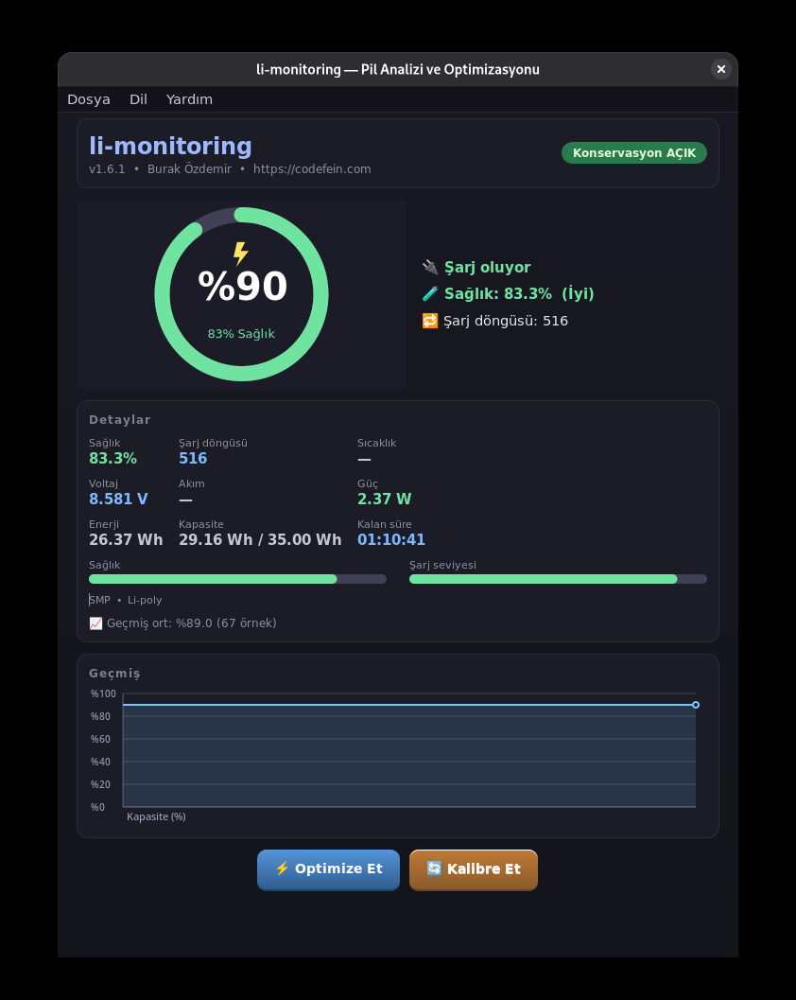
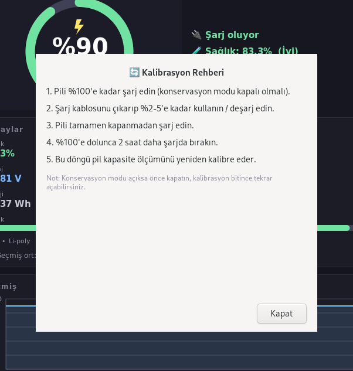
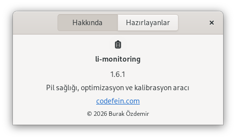

# ⚡ li-monitoring

**Linux dizüstü bilgisayarlar için GTK tabanlı pil sağlığı analizörü ve optimizasyon aracı.**

li-monitoring, laptopunuzun ham pil telemetrisini net bir tabloya dönüştürür: anlık kapasite, şarj döngüsü, sıcaklık, voltaj, akım ve güç tüketimi — ayrıca Lenovo laptoplarda **tek tıkla koruma modu (conservation mode)** ve pil kapasite ölçümünü doğru tutan adım adım **kalibrasyon** rehberi sunar.



## ✨ Özellikler

- 🧪 **Pil sağlığı analizi** — tasarım vs. tam kapasite, aşınma seviyesi ve not (Mükemmel / İyi / Orta / Zayıf / Kritik)
- 📈 **Canlı şarj geçmişi grafiği** — dakikada bir loglanan 240 örneğe kadar
- 🍩 **Donut göstergesi** — şarj yüzdesi, şarj göstergesi, sağlık halkası ve renk kodlu durum
- ⚡ **Tek tıkla koruma modu** (Lenovo) — şarjı %60–80 civarında durdurup pil ömrünü uzatır; ACPI `SBMC`/`GBMD` metodları (`acpi_call`) üzerinden çalışır
- 🔄 **Kalibrasyon rehberi** — kapasite göstergesini yeniden kalibre etmek için 5 adımlık prosedür
- 🧊 **Termal ve elektriksel telemetri** — sıcaklık, voltaj, akım, güç, enerji, dolu/boş kalma süresi tahminleri
- 🗂️ **Zengin detay paneli** — renk kodlu metrik ızgarası, sağlık ve şarj ilerleme çubukları
- 🌐 **5 dil** — Türkçe, English, Deutsch, Français, Español (çalışma zamanında değiştirilebilir)
- 🎨 **Modern koyu tema** — kart tabanlı düzen, gradyanlar ve keskin tipografi
- 📊 **CLI eşlikçisi** — canlı izleme, geçmiş ve tek seferlik JSON çıktısı

### Ekran görüntüleri

| Kalibrasyon rehberi | Hakkında |
|---|---|
|  |  |

## 🚀 Kurulum

### Hızlı kurulum (tek satır)

```bash
curl -fsSL https://github.com/burakkozddemir/li-monitoring/releases/latest/download/install.sh | bash
```

Ya da paketi manuel indirip kurun:

```bash
curl -fsSL -o li-monitoring.flatpak \
  https://github.com/burakkozddemir/li-monitoring/releases/latest/download/li-monitoring.flatpak
flatpak install --user li-monitoring.flatpak
```

### Flatpak (GitHub Release)

Sandbox'lı Flatpak sürümü **yalnızca izleme** amaçlıdır: koruma modu çekirdek seviyesindeki ACPI metodlarına dokunduğu için sandbox içinden izinli değildir; bu yüzden Optimize düğmesi kendini devre dışı bırakır. Tam koruma modu deneyimi için aşağıdaki **Sistem genelinde (Flatpak'sız)** kurulumu kullanın.

### Sistem genelinde (Flatpak'sız)

```bash
# Bağımlılıklar (GNOME masaüstlerinde zaten mevcut)
sudo apt install python3-gi gir1.2-gtk-3.0

# Lenovo koruma modu için acpi-call (opsiyonel ama önerilir)
sudo apt install acpi-call-dkms linux-headers-$(uname -r)
sudo modprobe acpi_call

# Yardımcı betik + şifresiz sudo kuralı
sudo install -m 755 li-battery-ctl.sh /usr/local/bin/li-battery-ctl
echo 'burak ALL=(ALL) NOPASSWD: /usr/local/bin/li-battery-ctl' | sudo tee /etc/sudoers.d/li-battery

# CLI + GUI giriş noktaları
sudo ln -sf "$PWD/li-monitoring.py"      /usr/local/bin/li-monitoring
sudo ln -sf "$PWD/li-monitoring-gtk.py"  /usr/local/bin/li-monitoring-gui
```

> **Not:** sudoers kuralındaki `burak` kullanıcı adını kendi adınızla değiştirin.
> Koruma modu yalnızca Lenovo `SBMC`/`GBMD` ACPI metodlarını sunan donanımlarda kullanılabilir; aksi halde Optimize düğümü kendiliğinden devre dışı kalır.

## 🖥️ Kullanım

Grafik arayüzü başlatın:

```bash
li-monitoring-gui
```

Terminal CLI'ı:

```bash
li-monitoring --watch          # terminalde canlı izleme
li-monitoring --history        # şarj geçmişi logunu dök
li-monitoring --json           # pil anlık görüntüsü (JSON)
li-monitoring --version        # sürüm ve geliştirici bilgisi
```

### Pil sağlığı yorumu

| Not | Kalan kapasite | Anlamı |
|---|---|---|
| 🟢 Mükemmel | ≥ %95 | Yeni gibi |
| 🟢 İyi | ≥ %80 | Hafif aşınma, müdahale gerekmez |
| 🟡 Orta | ≥ %60 | Belirgin aşınma; koruma modu önerilir |
| 🟠 Zayıf | ≥ %40 | Ciddi bozulma |
| 🔴 Kritik | < %40 | Pili yakında değiştirin |

**Optimize** düğmesi Lenovo koruma modunu açar/kapatır: açıkken şarj %60–80 civarında durur; bu, laptopu çoğu zaman prize takılı kullananlar için hücre aşınmasını önemli ölçüde azaltır.

## 🔧 Geliştirme

### Testleri çalıştırma

```bash
python3 -m unittest discover -s tests -v
```

Test takımı pil sağlığı matematiği, şarj/boşalma süresi tahminleri, değer biçimlendirme, geçmiş dosyası işleme ve CLI'ı kapsar (harici bağımlılık yok).

### Yerel Flatpak derlemesi

```bash
flatpak install -y flathub org.gnome.Platform//50 org.gnome.Sdk//50
flatpak-builder --repo=build/repo build/app flatpak/com.codefein.LiMonitoring.json
flatpak install --user build/repo com.codefein.LiMonitoring
```

### Depo düzeni

```
li-monitoring/
├── li-monitoring.py              # CLI uygulaması
├── li-monitoring-gtk.py          # GTK 3 arayüzü
├── li-battery-ctl.sh             # koruma modu yardımcısı (ana sistem tarafı)
├── install.sh                    # tek satırlık kurulumcu
├── CHANGELOG.md
├── tests/                        # birim testleri (stdlib unittest)
├── flatpak/
│   ├── com.codefein.LiMonitoring.json      # Flatpak manifesti
│   ├── com.codefein.LiMonitoring.desktop
│   └── com.codefein.LiMonitoring.metainfo.xml
├── data/
│   ├── com.codefein.LiMonitoring.svg       # uygulama ikonu
│   └── screenshots/                         # README ekran görüntüleri
└── .github/workflows/
    ├── ci.yml                    # her push/PR'de lint + test
    └── flatpak.yml               # sürüm paketini derleyip yayınlar
```

### Sürüm akışı

1. Bir sürüm etiketi oluşturun (`git tag v1.7.0 && git push origin v1.7.0`).
2. GitHub Actions Flatpak paketini derler ve GitHub Release'e otomatik yayınlar (`.github/workflows/flatpak.yml`).
3. Kullanıcılar bu dosyanın başındaki tek satırlık kurulumcuyla yükler.

## 📜 Lisans

GPL-3.0-or-later — bkz. [LICENSE](LICENSE).

---

**Geliştirici:** Burak Özdemir · [github.com/burakkozddemir](https://github.com/burakkozddemir) · [codefein.com](https://codefein.com)
